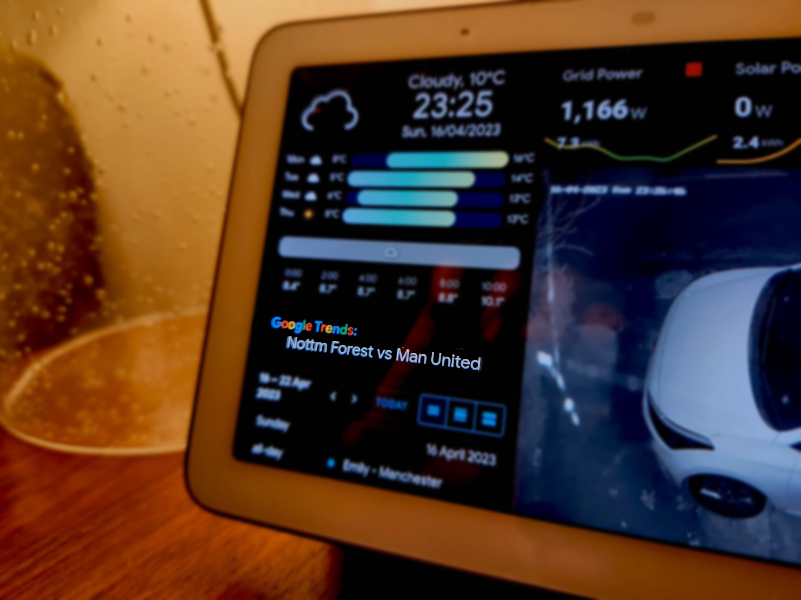

# <center>Google Trending Card </center>


This custom card displays the top trending searches from Google Trends on your dashboard. You will need to have installed the Google Trends integration from [here](https://github.com/b0mbays/google_trends) before using this card.

<p align="center">
  
</p>
<br/><br/>

🚀**Installation:**
============

### **HACS:**

1. Go to the HACS panel in Home Assistant and go to "Frontend".
2. Click on the three dots in the top right corner and choose "Custom repositories".
3. Enter `b0mbays/google-trends-card` in the "Add custom repository" field, select "Lovelace" from the "Category" dropdown, and click on the "Add" button.
4. Once the custom repository is added, you can install the custom card through HACS. You should see "Google Trending Card" in the "Frontend" tab. Click on "Download" to add it to your Home Assistant instance.

<br/><br/>

⚙️**Configuration**
============

1. Add the new card to your dashboard and using the "manual" card configuration. You can either do this via the "Add card" option, or add this manually inside the dashboard yaml file.

```yaml
type: 'custom:google-trends-card'
entity: sensor.google_trend
```
